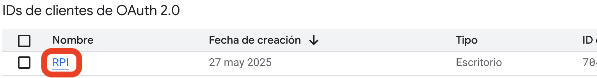

# Raspberry-conference-device

This project turns a Raspberry Pi into an automatic video meeting client. The Raspberry Pi retrieves all the meetings associated with the email account and displays them in a dashboard. This project is also designed to control the Raspberry Pi with the TV remote.
## Considerations

- Sorry if there are some things in spanish or if there is something bad translated but I tried my best.
- I use a TV LG so the remote controller might not work but i think it can be easily changed
- The script it can be used for Google meet, Microsoft teams, Zoom and Jitsi. If you put a URl on the calendar event it shoud open it anyway and you could navigate the web using the TV remote but it is not as comfortable as the others.
## Goals

* When someone uses this room, they turn on the TV and select the meeting they want to join.
* Easy to understand
* Easy to use
## Requirements

* Raspberry pi 4 / 5 (I have tried this with a Raspberry pi 5 but I think that if the Raspberry is powerfull enough it could work)
* TV with HDMI-CEC (I used a LG so this will affect to the TV remote controll)
* HDMI cable that supports HDMI-CEC (Most cables have this)
* A camera and a microphone
* The user **must** be "pi"
* It has to be a Raspberry desktop
* Chromium has to be in english or spanish (This is not necessary to the program to work but there are some automation features that are not going to work)
* The email account must have google calendar
## Installation guide

### 1. Allow the script access to the calendar

First of all you have to access your [google cloud console](https://console.cloud.google.com/)
You have to select your current project on the left and then on the pop-up window, on the top right corner you create a new one.


Then you open the left menu with the 3 bars and go to "APIs and services" > "Credentials".


Next you have to create a new OAuth ID client. You select desktop app and give a name. This will pop-up a window and you scroll down and you can download a JSON. **IMPORTANT** to rename it to "credential.json" and move it to the same folder as the "Setup.sh".


Next you need to put your email like a test user. To do this you have to open your recently created client.

Then on the left you go to public and scroll down to test users and you add the email of the account that is going to be in the Raspberry.


Then we have to enable the Google calendar API. To do this you go to "APIs and services" > "APIs and services enabled" and you click the button to enable APIs and services. Then you search for "Google calendar API" and enable it.


### 2. Change wayland to X11

This script uses unclutter to hide the mouse automatically when it is inactive, and it doesn't work on wayland. (I don't know if not changing this will affect other things)
To change it you have to open a terminal and write
```bash
sudo raspi-config
```
Then you go to "6 Advanced options" > "A6 Wayland" > "W1 X11".
This might reboot your system

### 3. Generate token

First you open chromium and log in with the account.

The next thing is to download this repository into your Raspberry and give permission to execute the setup.sh.
```bash
chmod +x Setup.sh
```
This script will create a folder on your home named "RPI-Conference". Also this is going to create 2 services to run the calendar and another one to control the Raspberry with the TV remote.

The service will open a terminal to allow chrome, if you write "A" -> Always this will work.
Then this will open a chromium browser (If you are slow this might open multiple window, but this is normal) and you have to select your account and give permission. And with this, all should work

### 4. Setup Tampermonkey

This is used to facilitate navigation on meeting websites.
First you have to add to chromium the Tampermonkey extension from the chrome web store

When you enter there, you search for Tampermonkey and install it. 
Then you go to your extensions and you have to enable developer mode(top right corner), to make Tampermonkey work.


Once this is active, you can now add the script. To do that you have to open the Tampermonkey script editor on the top right corner, in extensions.


Finally you have to erase the default new script and paste the script you downloaded (Tampermonkey) and then save or you can drag and drop the file and click on install.

Make sure tampermonkey is enabled and the new script is enable.

### 5. Recomendation

You can create a test meeting for all platforms you want to use it, this is for testing that all works and for give permission to the camera and microphone.
## Troubleshooting

* Make sure CEC is enabled on your TV (Depending on the brand will have a different name)
* Try stopping the service and executing the script manually
```bash
sudo systemctl stop abrir-reunion.service
python3 /home/pi/RPI-Conference/Abrir-reunion.py
```
* If the TV remote doesn't work stop the service and try this and see what happen
```bash
sudo systemctl stop cec_control.service

cec-client | while read line; do
    echo "$line" | grep "key pressed" && echo "¡Botón pulsado!"
done
```
If this does nothing try installing kodi and try to run it
```bash
sudo apt-get install kodi -y

kodi
```
* At the moment the first time chromium opens it might be pretty slow but then it should work fine
* If in the dashboard the meeting doesn't open make sure the link it is in the location, description or the google meet and be careful if there are multiple links on the event(The script just picks the firstt).
## Usage

This part is thinking that all things are working fine(I am using meet as example but all supported meeting webs work similar)

The script will open a HTML (on full screen) with the events in the next 7 days (Name, Start date, finish date), and if you click it will open the link.

Once the link is open the button to join the meeting will be selected, so you just have to click it (with the TV remote it will be just pressing the ok button). 

When you are inside the meeting, if you press Shift+M (With the TV remote it will just be click one button) you will mute or unmute the microphone. Also if you press Shift+S (With the TV remote it will just be click one button), chrome is going to ask if you want to leave the meeting, if you say yes the meeting window will close and go back to the event dashboard (Except in Zoom where you have to press Shift+S multiple times)

If at the moment of joining the meeting you have problems, the tv remote is configured to be use as a kind of mouse.

#### Example of my tv remote:

**Arrows:** keyboard arrow / mouse movement

**Exit/Back:** delete / right click

**OK:** enter / left click

**Stop:** switch between keyboard/mouse mode

**Forward:** Tab

**Backward:** Shift*Tab

**Red:** Shift+S

**Green:** Shift+M

**Yellow:** F5

**Blue:** F11
